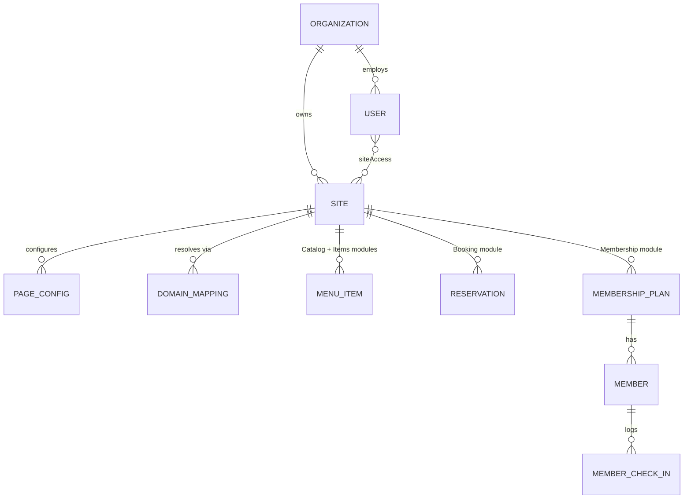

# Multi-Vertical Platform Plan
## Turning the Restaurant CMS into a Multi-Org, Multi-Vertical Website Builder & Hosting Platform

> This document extends **`Restaurant Website – Admin Content Management System Plan.md`** ("**v1 plan**"). It does not replace it — every mechanism the v1 plan describes (draft/publish, section-based homepage editor, media library, theme tokens, restaurant-scoped multi-tenancy) is kept. This document adds a layer **above** a single "Restaurant" tenant so the platform can host **Restaurants, Gyms, and Retail stores** side by side, under **Organizations** that log in and manage **one or more Sites**, with **renameable pages**, **swappable page layouts**, a new **Membership** module, a browse-only **Items** module, and **self-service custom domain hosting**.
>
> Audience: this is a shared spec for **frontend** (this repo) and **backend** (API + infra). Section 13 is the backend contract; everything else has frontend implications too.

---

# 1. Why this change

Today the codebase is single-tenant-shaped even though the v1 plan already keyed every record by `restaurantId` (v1 §3). The assumptions baked into the UI and data model are restaurant-specific:

- The nav says "Menu" and "Reservation" — hardcoded copy, not configurable.
- Login is `email + password` against one implicit business.
- There is one page "type" per concept (Menu page, Reservation page) with one fixed layout each.
- There's no concept of an "Organization" that could own multiple businesses, and no concept of "which vertical is this business" (restaurant/gym/retail).
- Hosting is a single deployed site; there's no per-tenant custom domain flow.

The goal is a platform where:

1. A business signs up (or is provisioned) as an **Organization**.
2. Inside that Organization they create one or more **Sites**, each tagged with a **Vertical**: `restaurant | gym | retail`.
3. Each Site gets the *same admin editing experience the v1 plan already describes* (branding, homepage sections, media, etc.) — that doesn't change.
4. Each Site additionally gets four vertical-flavored **modules** — **Items** (a browse-only "see what we offer" page, new), **Catalog** (today's "Menu", now specifically the *cart/checkout* experience - "Online Order"), **Booking** (today's "Reservations"), and **Membership** (new) — each renameable in the nav, and each with **3 selectable layout templates** that any vertical can use.
5. Each Site can be reached at a platform subdomain (`acme.ourplatform.com`) or the org's own custom domain, set up the way Vercel does it: we give you a DNS record, you paste it into your registrar, we verify and issue SSL automatically.

---

# 2. Core concepts & terminology

| Term | Meaning |
|---|---|
| **Organization (Org)** | The billing/tenant boundary a user logs into. Owns one or more Sites, users, and the Org-level subscription. Replaces "the restaurant account" as the top-level tenant. |
| **Site** | One website + its admin panel. Today's "Restaurant" *is* a Site. A Site has exactly one **Vertical**, one set of branding/homepage/media (v1 plan, unchanged), and its own **Items / Catalog / Booking / Membership** module configs. `Site.id` is the same key the codebase currently calls `restaurantId` (see §12 migration — we are not renaming the column, just widening what it means). |
| **Vertical** | `restaurant \| gym \| retail`. Drives *default* copy, module defaults, and template suggestions at Site-creation time only. It never restricts what a Site owner can pick later (§9). |
| **Module** | A functional page type with its own data model: **Items**, **Catalog**, **Booking**, **Membership**. Every Site can enable/disable/rename each module independently. |
| **Items module** | A browse-only "menu/programs/products" page - view only, no add-to-cart, no checkout (§8.5). Reads the *same* underlying Catalog data (categories/items) as the Catalog module, it just never shows a buy action. Exists so a Site can showcase what it offers without turning on online ordering. |
| **Page Config** | Per-Site, per-module settings: `enabled`, `navLabel` (the renameable nav text, e.g. "Menu" → "Programs"), `order`, `templateVariant`. |
| **Template Variant** | One of 3 fixed, professionally-designed layouts per module (§9). Freely selectable regardless of Vertical — "suits X" is a *suggestion*, not a restriction, per the user's explicit requirement. |
| **Domain Mapping** | The link between a Site and either its platform subdomain or a verified custom domain (§10). |

---

# 3. Data model

## 3.1 New entities

```text
Organization
------------
id
name
orgSlug              // used only for display; login uses orgId/org code, not slug
billingPlan           // free | starter | pro ... (out of scope for this doc, flagged in §16)
createdAt
updatedAt

Site  (extends today's "Restaurant" row — see §12)
----
id                    // = today's restaurantId
organizationId        // NEW - FK to Organization
vertical              // NEW - 'restaurant' | 'gym' | 'retail'
name
slug                  // subdomain-safe slug, used for {slug}.platform.com
status                // active | suspended | draft
brandingBadgeEnabled  // NEW - "Powered by Astryd" footer badge; Super Admin only, see §5.2
createdAt
updatedAt

User  (extends today's User)
----
id
organizationId        // NEW - a user belongs to exactly one Org
email                 // unique PER organization, not globally (see §5)
name
role                  // 'platform_super_admin' | 'org_owner' | 'org_staff'
siteAccess            // NEW - Id[] | 'all'  (which Sites within the Org this user can touch)
permissions
isActive

PageConfig            // NEW - one row per (Site, module)
----------
id
siteId
module                // 'items' | 'catalog' | 'booking' | 'membership'
enabled               // boolean - hide the nav item entirely
navLabel              // "Menu" | "Programs" | "Products" | anything the owner types
order                 // nav ordering
templateVariant       // 'a' | 'b' | 'c'  (see §9 for what each means per module)
updatedAt

DomainMapping          // NEW
--------------
id
siteId
type                  // 'platform_subdomain' | 'custom_domain'
hostname              // e.g. "acme.ourplatform.com" or "www.acmegym.com"
verificationStatus    // 'pending' | 'verified' | 'failed'   (n/a for platform_subdomain, always verified)
verificationToken     // random token used in the TXT record, see §10
dnsInstructions        // { recordType: 'CNAME'|'A'|'TXT', name: string, value: string }[]
sslStatus              // 'pending' | 'issued' | 'error'
isPrimary               // which mapping is canonical for redirects
createdAt
verifiedAt
```

## 3.2 New module data (per Site)

```text
MembershipPlan
--------------
id
siteId
name                  // "Monthly Unlimited", "Loyalty Tier – Gold", "VIP Club"
description
priceCents
billingInterval        // 'one_time' | 'monthly' | 'quarterly' | 'yearly'
benefits               // string[]
isActive
order

Member
------
id
siteId
planId
customerName
customerEmail
customerPhone
status                 // 'active' | 'paused' | 'cancelled' | 'expired'
startDate
nextBillingDate | null
notes

MemberCheckIn          // optional, mainly used by the Gym-flavored template, but generic
--------------
id
memberId
siteId
checkedInAt
```

`Catalog` (today's Menu/Categories/Items/Add-ons/Offers) and `Booking` (today's Reservations/Availability) **keep their existing v1 schemas** — see §12 for the only change they need (adding `siteId` in place of `restaurantId` conceptually, no column rename required). The new **Items** module (§8.5) introduces **no new tables at all** - it reads the exact same Categories/Items rows as Catalog, just renders them without any buy action.

## 3.3 Relationship diagram



---

# 4. Authentication: Org-scoped login

Login form becomes 3 fields, per the requirement:

```text
Org ID
Email
Password
```

- **Org ID** is a short, user-facing code (e.g. `ORG-4F82` or a chosen slug like `acme`), not the internal UUID. It disambiguates users whose email is reused across organizations (an agency managing several client Orgs, or a franchise, might reuse `manager@theirdomain.com` in more than one Org).
- Uniqueness constraint moves from `email` (global) to `(organizationId, email)`.
- `POST /auth/login` now takes `{ orgId, email, password }`. Backend resolves the Org first, then looks up the user inside it.
- Session/JWT payload gains `organizationId` and `siteAccess` claims so every subsequent API call is scoped without re-checking on every request.
- **Migration note:** existing Lumière users get an auto-created Org (`Lumière`) with an auto-generated Org ID communicated to them once (§12).
- Forgot-password flow (v1 §4) also needs Org ID now, or we support "forgot my Org ID" via email lookup across a `(email) → possible orgs` index — flag this as a UX decision in §17.

## 4.1 Super Admin login is a separate page, not a mode toggle

Per §5.1, Super Admin isn't scoped to any Organization, so it never enters an Org ID - it gets its own page (a distinct URL, `/admin/superadmin/login`, not a checkbox/tab on the Org-scoped login):

```text
Email
Password
```

`POST /auth/super-admin-login` takes `{ email, password }` only, resolves the user against `role = platform_super_admin` directly (no Org lookup), and returns the same session shape as the Org-scoped login. Each login page links to the other ("Platform team? Sign in here" / "Not platform team? Sign in to your Organization") for discoverability without merging the two forms.

# 5. Roles & permissions

Extends v1 §4 roles with an Org layer:

| Role | Scope | Can | Creates |
|---|---|---|---|
| **Platform Super Admin** | Everything, all Orgs | Create/suspend Orgs, impersonate for support, view platform-wide billing/usage, manage the platform's own template library, control the "Powered by Astryd" badge (§5.2) on any Org's Site(s). | **Organizations** (and their one Org Owner account). |
| **Org Owner** | One Organization | Create/delete Sites within their Org, invite/manage Org Staff, manage billing, full edit rights on every Site (unless they scope themselves down). | **Org Staff** only - never another Owner, never a new Org. |
| **Org Staff** | One or more specific Sites (`siteAccess`) | Same content permissions v1 §4 already defines (menu, branding, homepage, media, offers, add-ons, settings), but scoped to the Sites listed in `siteAccess`. | Nobody. |

The existing `Permission` interface (menu/branding/homepage/media/offers/addons/settings/users) is unchanged in shape — it now also gets `booking` and `membership` flags for the two new modules, and applies per-Site rather than globally.

## 5.1 Account-creation hierarchy (who creates whom)

This is a hard rule, not just a default:

- **Platform Super Admin is us** - the only role that can create a new Organization. Creating an Org always creates exactly one **Org Owner** account alongside it (§6B) - there is no path in this product where an Org Owner account is self-registered or created by anyone other than a Super Admin.
- **Org Owner creates Org Staff** - and *only* Staff. An Org Owner cannot create another Owner, cannot create a new Organization, and cannot promote a Staff account to Owner. If ownership needs to change hands, that is a Super Admin action (transfer or re-provision), not a self-service one.
- **Org Staff creates nobody.**

```text
Super Admin  →  creates  →  Organization + its one Org Owner
Org Owner    →  creates  →  Org Staff  (for their own Org only)
Org Staff    →  creates  →  (nothing)
```

Enforcement: the invite-user UI only ever offers a role picker containing roles *below* the inviter's own (Owner sees "Staff" only; Super Admin's org-creation flow is the only place an "Owner" account gets created) - and the backend must reject any request that tries to create a role higher than or equal to the caller's own, regardless of what the client sends.

## 5.2 Platform branding control ("Powered by Astryd")

Every Site's public footer carries a "Powered by Astryd" badge (this already existed pre-platform, in the v1 footer). In the multi-tenant world this becomes a **Super-Admin-exclusive lever**, not a Site setting:

- `Site.brandingBadgeEnabled: boolean` (default `true`) lives on the Site record, next to `organizationId`/`vertical` (§3.1) - not inside `BrandSettings`, specifically so an Org Owner's full read/write access to their own branding can never touch it.
- Only a Super Admin can flip it, from a **Platform → Sites** console page listing every Site across every Org, each with its own toggle - this is a new, previously-nonexistent "Platform" area of the admin app, visible only to `platform_super_admin`.
- The public footer reads this flag (read-only, publicly) and shows/hides the badge accordingly; an Org Owner has no UI control that touches it at all.
- Product intent (not enforced by the schema, just noted here): this is the natural lever for a future "remove branding on a paid plan" offering, so the flag is boolean-and-per-Site now specifically so it can key off a future billing plan later without a schema change.

# 6. Site creation & onboarding

Two paths, both should exist:

**A. Self-serve wizard** (Org Owner, from inside the admin panel, for *additional Sites within their own existing Org* - never for a new Org):

1. **Vertical** — pick Restaurant / Gym / Retail. This only seeds sensible defaults (see table below), it is never a lock-in.
2. **Name + slug** — becomes `{slug}.ourplatform.com` immediately (this is the platform subdomain, always available, always valid SSL — see §10).
3. **Module defaults** — pre-checks which of Items/Catalog/Booking/Membership are enabled and pre-fills their nav labels + a suggested template variant, editable immediately:

   | Vertical | Items default label | Catalog ("Online Order") default label | Booking default label | Membership default |
   |---|---|---|---|---|
   | Restaurant | "Menu" | "Online Order" | "Reservations" | off by default (owner can turn on — e.g. a chef's table club) |
   | Gym | "Programs" | off by default, "Shop" if turned on (most gyms don't sell online) | "Classes" | on, "Membership" |
   | Retail | "Products" | "Online Order" | "Appointments" (off by default for pure e-comm retail; on for stores that book fittings/consultations) | on, "Loyalty" |

   Items is **on by default for every Vertical** - it's the lowest-friction, view-only page, so there's no reason to hide it at onboarding the way Catalog/Booking/Membership sometimes are. Catalog's default label changes from the old "Menu" to **"Online Order"** now that Items has taken over the plain "show me what you offer" role - Catalog is specifically the *buy it now* module going forward (§8.5 explains the split).

4. **Branding** → same flow as v1 §11.
5. **Publish** → same as v1 §34.

**B. Platform-provisioned** (Super Admin) — **the only way a new Organization (and its Org Owner account) comes into existence**, per §5.1. Same 5 steps run on the client's behalf, plus creating the Org and its Owner account first — this is the v1 §43 flow, just adding the Vertical pick and Org+Owner creation in front of it.

# 7. Page naming (nav label customization)

Every module's nav entry is data, not copy. The admin's Sidebar/topbar nav (the public site's header nav too — "Discover / Menu / Reservation" per the current header component) reads `PageConfig.navLabel` per module instead of a hardcoded string.

- Admin UI: a new **"Pages"** settings screen listing the 3 modules, each with:
  - Enabled toggle
  - Text field for the nav label ("Menu" → anything, e.g. "Programs")
  - Drag-to-reorder
  - Template variant picker (§9)
- Public site: the header/nav component (`Header.tsx` today) renders labels from `PageConfig` instead of literals; the hash-router page keys stay stable internal identifiers (`items`, `menu`, `reservations`, `membership` as *route keys*) even when the *displayed* label changes — i.e. renaming "Menu" to "Programs" changes the text, not the URL structure, unless the owner also wants pretty custom paths (flagged as a nice-to-have in §17).

## 7.1 Default nav order

`Discover` (the landing page) isn't a module - it's not in `PageConfig` at all, and it always renders first, unconditionally; every module-driven nav entry comes after it. The default `order` seeded for the 4 modules follows a "lowest commitment → highest commitment" progression:

```text
Discover  →  Items  →  Catalog ("Online Order")  →  Booking ("Reservation")  →  Membership
(fixed)      browse      buy right now               book a future visit        join/subscribe
```

This is only the **seeded default** - the Pages settings screen (§7) already lets an owner drag any module (including Items) into any position, or hide it entirely, so this ordering is a starting point, not a constraint. It's a deliberate change from a literal reading of the feature request (which listed Membership before Reservation); the reasoning for defaulting Booking ahead of Membership is that "book something now" is a lighter commitment than "join something," so it reads more naturally earlier in the funnel - flagged as open question §15.7 in case the product call should go the other way.

# 8. The Module + Template system

This is the core of the "3 layouts × 3 modules, usable by anyone" requirement.

## 8.1 Design rule

A **module** defines *what data exists and what it means* (a catalog item has a name/price/image; a booking slot has a time/capacity; a membership plan has a price/interval). A **template variant** defines *how that same data is laid out on the page*. Switching template variants never touches the underlying data — it's a pure rendering choice, exactly like picking a different Squarespace template.

## 8.2 Catalog module templates

| Variant | Suggested for | Layout |
|---|---|---|
| **A — Menu Grid** | Restaurant | Category tabs, dish cards with photo/price/description, "Featured" rail — today's existing Menu page, lightly generalized. |
| **B — Program Schedule** | Gym | Weekly/daily class-style grid grouped by time slot, each "item" shown as a scheduled session (instructor, duration, capacity) rather than a dish card. |
| **C — Product List/Catalog** | Retail | Dense filterable grid/list with SKU, price, stock badge, size/variant chips — closer to an e-commerce catalog page. |

All three read from the **same** `Catalog` data model (categories + items + add-ons/offers, v1 §15-§26 unchanged); a restaurant can pick Variant C if they want a denser list, a retail store can pick Variant A if they want a lookbook feel.

## 8.3 Booking module templates

| Variant | Suggested for | Layout |
|---|---|---|
| **A — Table Reservation** | Restaurant | Today's existing 4-step flow (party size → date/time → details → confirm), calendar-driven (the calendar work already shipped in this repo). |
| **B — Class/Session Booking** | Gym | Weekly timetable grid, pick a class + instructor + spot, capacity bar ("6/12 spots left"). |
| **C — Appointment Booking** | Retail | Service/staff picker → duration-based slot picker (like a salon/consultation booking) rather than a fixed table slot. |

All three read from the **same** `Reservation` + `ReservationAvailabilitySettings` model already built in this repo (day-of-week × slot-duration × capacity, from the recent Availability tab work) — the "party size" field just gets relabeled ("Guests" / "Spots" / "People") per Vertical default copy, still editable.

## 8.4 Membership module templates (new module)

| Variant | Suggested for | Layout |
|---|---|---|
| **A — Loyalty/Rewards** | Restaurant | Points/visits based; a simple tier card + "how it works" — light-touch, optional deposit/credit. |
| **B — Plan Tiers + Check-in** | Gym | Pricing-table style plan comparison, "Join" CTA, member check-in history in the account area. |
| **C — VIP/Store Credit Club** | Retail | Subscription-box style tiers, store-credit balance display, early-access perks list. |

All three read from the **same** `MembershipPlan` + `Member` (+ optional `MemberCheckIn`) model in §3.2.

## 8.5 Items module templates (new module, browse-only)

Unlike Booking/Membership variants (which mirror Catalog's layout style per-Vertical), Items is deliberately **not** "Catalog minus a button." It's a showcase-first presentation - large imagery, generous whitespace, editorial/lookbook framing - built to make the range look good, not to move it through a purchase flow. Catalog stays exactly as it is today (grid/list + qty stepper + add-to-cart, unchanged); Items is a visually distinct sibling that happens to read the same rows.

| Variant | Suggested for | Layout |
|---|---|---|
| **A — Editorial Showcase** | Restaurant | Full-bleed hero-style dish photography, one or two items per row, category as section dividers with generous spacing - closer to a printed tasting menu or lookbook spread than a grid. Name, description, price - no stepper, no "Add" button. |
| **B — Program Spotlight** | Gym | Large-card carousel/rail grouped by program (not by time slot) - photo, instructor, a short pitch - built to sell the *program*, not to show a bookable calendar (that's the Booking module). |
| **C — Product Lookbook** | Retail | Masonry/full-width imagery grid, minimal chrome, no stock badges or variant chips - a styled catalog spread for browsing the range, not transacting on it. |

All three read from the **same** `Catalog` data (categories + items) as §8.2's Catalog module - Items is a rendering choice, not a separate content source, so an owner never has to enter the same menu twice, and a price change made in one place is instantly correct in both. The two modules can therefore diverge sharply in *look* (Items stylish/showcase, Catalog utilitarian/transactional) while never diverging in *content* - and Items never renders a buy/add-to-cart affordance, by design, even if the same item is purchasable via Catalog elsewhere on the same Site.

## 8.6 Why this satisfies "all three usable by any of these three"

Template variant is stored purely as `PageConfig.templateVariant ∈ {a,b,c}` per Site per module — a Retail site is free to set `booking.templateVariant = 'a'` (Table Reservation) if they run a wine-tasting counter, and nothing in the schema stops them. The same is true for Items: a Gym could pick Items Variant C (Product List) if it prefers a plain spec-sheet over a schedule-style layout. The Vertical field never gates a variant; it only pre-selects one at Site creation.

# 9. Custom domain hosting (the "Vercel-style" flow)

## 9.1 What the Org sees

**Domains** settings screen, per Site:

1. **Default domain** (always present, never removable): `acme.ourplatform.com` — instant, always HTTPS, zero setup.
2. **"Add a custom domain"**: Org types `www.acmegym.com` → we create a `DomainMapping` row and return DNS instructions, rendered exactly like Vercel's UI:

   ```text
   Type     Name              Value
   -----    ---------------   --------------------------
   CNAME    www               cname.ourplatform.com
   ```

   (For an apex/root domain like `acmegym.com` with no `www`, we instead show an **A record** pointing at our edge's anycast IP, or recommend `ALIAS`/`ANAME` where the registrar supports it — same dual-path Vercel itself uses.)

3. Org pastes that into their registrar (GoDaddy, Namecheap, Cloudflare, etc.) — **outside our platform**, same as buying/managing the domain itself is explicitly out of scope (the user's phrasing: "we paste it on the platform we purchased the domain" confirms domain *purchase* stays with a registrar; we only handle *pointing* it at us).
4. We poll DNS for that hostname in the background; status flips `pending → verified` automatically, no manual "check now" needed (but we provide one anyway for impatient users).
5. Once verified, SSL is provisioned automatically (see 9.3) and the custom domain starts serving that Site's content; the platform subdomain keeps working (or optionally 301-redirects to the custom domain, Org's choice).

## 9.2 Request-time tenant resolution (backend + edge)

Every incoming request's `Host` header must resolve to exactly one `siteId` before any Site-scoped API call or page render happens:

```text
Host header  →  DomainMapping lookup (hostname → siteId)  →  everything downstream is siteId-scoped
```

This lookup needs to be fast (edge cache / in-memory map refreshed on DomainMapping changes), since it now sits in front of *every* request, not just admin API calls.

## 9.3 Build vs. buy for SSL + routing (recommendation)

Hand-rolling wildcard SSL + a multi-tenant reverse proxy (ACME DNS-01 automation, anycast IP management, cert renewal cron) is a significant infra investment. Two pragmatic options for the backend guy, in order of recommendation:

1. **If we're deploying on Vercel already** (this is a Vite app): use **Vercel's own Domains API** to programmatically add each customer's domain to our Vercel project. Vercel returns the exact `CNAME`/`A` target and verification status via API, and auto-issues SSL — this is *literally* the flow the user described, and we'd just be wrapping Vercel's existing multi-tenant domain support instead of rebuilding it.
2. **If we're not on Vercel** (custom infra / Cloudflare-fronted): use **Cloudflare for SaaS** ("Custom Hostnames" API) — same idea, Cloudflare issues and manages the certs, we just register/verify hostnames via API.
3. **Full self-build** (only if neither is viable): DNS-01 ACME automation (e.g. via `certbot`/`acme.sh` against a wildcard cert + SNI-based routing in nginx/Envoy) — significantly more ops burden, listed here for completeness, not as the recommended path.

Whichever is chosen, the **frontend contract stays the same**: the admin UI just needs `{recordType, name, value}` + a `verificationStatus`/`sslStatus` enum from the API (§13.6).

# 10. Frontend (admin) changes

1. **Login page**: add Org ID field; persist it in the session the same way `restaurantId` is resolved today via `RestaurantContext` — rename/extend that context to also carry `organizationId` and the active `siteId`.
2. **Site switcher**: if a user's Org has >1 Site, add a switcher near the sidebar's brand mark (same slot the "Lumière" logo/name occupies today) — switching Sites re-scopes all `admin-*` React Query cache keys (they already key by `restaurantId`; just confirm every hook does, so a switch invalidates cleanly).
3. **"Pages" settings page** (new, §7): enable/disable/rename/reorder the 3 modules + pick template variant.
4. **Membership admin pages** (new): mirrors the existing Orders/Reservations admin page pattern already built in this repo (list + filters + detail modal + a "Plans" management tab) — same `DataTable`/`Modal`/`PageHeader` components, no new UI kit needed.
5. **Domains settings page** (new): the DNS-instructions UI from §9.1, with status polling (reuse the `refetchInterval` pattern already used by `useOrders`/`useReservations`).
6. **Sidebar nav**: swap the hardcoded "Orders"/"Reservations" labels for `PageConfig.navLabel`, keep the recently-flattened, non-collapsing group style for all sections (matches the sidebar redesign already shipped).
7. **Public site**: `Header.tsx`'s nav and the page components (`MenuView`, `ReservationView`) become **template-variant-aware** — each module gets a small `variants/` folder (`catalog/VariantA.tsx`, `VariantB.tsx`, `VariantC.tsx`) selected by `PageConfig.templateVariant`, all consuming the same data hooks. This is additive: today's `MenuView`/`ReservationView` become "Variant A" for their modules, so nothing existing breaks.
8. **Items module** (new): its own `items/` variants folder (VariantA/B/C, §8.5) - a distinct, showcase-style presentation (large imagery, editorial spacing), not a trimmed copy of the Catalog variants - reusing the exact same menu data hooks Catalog already uses so content only has to be entered once, just rendering without any cart/buy affordance; `Header.tsx`/`Footer.tsx` gain a 4th conditional nav link (`isModuleEnabled('items')`), same pattern as the Membership link added in Phase 3.

# 11. Non-goals (explicitly out of scope for this doc)

- Domain **purchase**/registration (we only handle pointing an already-owned domain at us).
- Platform billing/subscription plans for Orgs (flagged as a future doc).
- Payment-processor sub-merchant onboarding per Site (Finix integration already exists per-Site today; multi-vertical payment routing, if needed, is a separate spec).
- A visual drag-and-drop page builder beyond the existing "content within fixed sections" model (v1 §6 principle is preserved, not loosened).

# 12. Migration plan (existing Lumière data → new model)

1. Create one `Organization` row (`name: "Lumière"`), generate its Org ID, email it to the current owner once.
2. Existing `restaurantId` (`rest_lumiere`) becomes the first `Site.id`, with `Site.organizationId` = the new Org, `Site.vertical = 'restaurant'`.
3. Existing `User` rows get `organizationId` backfilled to the new Org; uniqueness constraint on `email` is dropped and replaced by `(organizationId, email)`.
4. Seed `PageConfig` rows for the existing Site: `items` (enabled, label "Menu" — reuses Lumière's existing label rather than the new default "Menu"/"Discover The Menu" wording, so nothing changes visually), `catalog` (enabled, label "Menu", variant A — **kept as "Menu", not renamed to "Online Order"**; see note below), `booking` (enabled, label "Reservations", variant A), `membership` (disabled by default, so nothing new appears in nav until the owner turns it on).
   - **Note (§7.1/§15.7)**: the new default nav label for Catalog on *newly created* Sites is "Online Order", and Items is on by default everywhere. Neither applies retroactively — Lumière already has a published "Menu" label and no Items page in its nav; the migration must not silently add a nav item or rename an existing one out from under a live site. If the Org Owner wants Items enabled or wants Catalog relabeled, that's a manual toggle in Settings → Pages after migration, same as any other Page Config change.
5. Seed 1 `DomainMapping` row: `type: platform_subdomain`, `hostname: lumiere-mayfair.ourplatform.com` (or keep the current production domain as a `custom_domain` mapping marked already-verified, so the live site doesn't move).
6. No changes needed to existing Menu/Orders/Reservations tables beyond conceptually treating `restaurantId` as `siteId` — **no column rename required** to ship this migration; a rename can happen later as pure refactor once the Org layer is stable.

# 13. Backend API contract (additions to v1 §31)

| Area | Endpoint | Notes |
|---|---|---|
| Auth | `POST /auth/login` | Body gains `orgId`. |
| Auth | `POST /auth/super-admin-login` | Body: `{ email, password }` - no `orgId`, resolves against `platform_super_admin` directly (§4.1). |
| Auth | `GET /auth/resolve-org?email=` | Optional: list Orgs an email belongs to, for "forgot my Org ID" UX. |
| Orgs | `POST /orgs`, `GET /orgs/:id`, `PATCH /orgs/:id` | Super Admin + self-serve signup. |
| Sites | `POST /orgs/:orgId/sites`, `GET /orgs/:orgId/sites`, `PATCH /sites/:id`, `DELETE /sites/:id` | Vertical set at creation, editable later (edge case: changing vertical after launch is a data question, likely disallow or handle as "re-onboard"). |
| Pages | `GET /sites/:id/pages`, `PATCH /sites/:id/pages/:module` | Body: `{ enabled, navLabel, order, templateVariant }`; `module` now includes `'items'`. |
| Items | *(no new endpoints)* | Reuses the existing `GET /restaurants/:id/menu` (categories + items) that Catalog already calls — Items is a read-only rendering of the same data, so there is nothing new for backend to build here. |
| Membership | `GET/POST/PATCH/DELETE /sites/:id/membership/plans`, `.../members`, `.../members/:id/check-ins` | Mirrors existing Catalog/Booking CRUD conventions. |
| Domains | `POST /sites/:id/domains` (body: `{hostname}`) → returns DNS instructions | |
| Domains | `GET /sites/:id/domains` | List + statuses. |
| Domains | `POST /sites/:id/domains/:id/verify` | Manual re-check trigger; also runs on a backend cron regardless. |
| Domains | `DELETE /sites/:id/domains/:id` | |
| Tenant resolution | *(internal, not public API)* | `GET` by `Host` header → `siteId`, used by the edge/middleware layer per §9.2. |
| Platform (Super Admin only) | `GET /superadmin/sites` | Every Site across every Org, joined with Org name - powers the Platform → Sites console (§5.2). |
| Platform (Super Admin only) | `PATCH /superadmin/sites/:id/branding-badge` (body: `{enabled}`) | The only write path for `Site.brandingBadgeEnabled`; rejects any caller who isn't `platform_super_admin`. |
| Platform (public, read-only) | `GET /public/sites/:id/branding-badge` | Used by the public footer to decide whether to render the badge; deliberately separate from the Org-editable brand/website endpoints (§5.2). |

All existing v1 §31 endpoints (`/restaurants/:id/...`) keep working unchanged — read `:id` as "siteId" going forward; no URL restructuring required for this phase.

# 14. Execution plan — phase by phase, Frontend vs. Backend

7 phases now (Phase 4 - Items module - added below), broken into concrete, assignable tasks per side. Within a phase, backend tasks generally need to land (or at least be contract-frozen and mocked) before the matching frontend task starts; across phases, 2/3/4 can run in parallel once Phase 1 is done.

## Phase 0 — Foundation (Org layer + data migration)
*No visible feature change yet — this is plumbing. Retrofitted 2026-09 to add §5.1's account-creation hierarchy and §5.2's branding-badge control after Phases 0-2 had already shipped — see the "Retrofit" bullets below.*

**Backend**
- Design & migrate schema: new `organizations` table; add `organization_id` to `users` and `restaurants`(→Site) tables.
- Drop the global-unique constraint on `users.email`; add unique `(organization_id, email)`.
- `POST /auth/login` accepts `{ orgId, email, password }`; resolves Org first, then user inside it.
- Session/JWT gains `organizationId` + `siteAccess` claims; `GET /auth/me` returns them.
- One-off migration script implementing §12 (create the Lumière Org, backfill `organization_id` on existing rows, generate + hand off its Org ID).
- **Retrofit (§5.1):** the invite-user endpoint must reject a role ≥ the caller's own regardless of what the client sends (Owner can never mint another Owner via a crafted request).
- **Retrofit (§5.2):** add `brandingBadgeEnabled` to the Site table; `GET /superadmin/sites`, `PATCH /superadmin/sites/:id/branding-badge` (Super Admin only), `GET /public/sites/:id/branding-badge` (public, read-only).

**Frontend**
- Add Org ID field to the login form; update `LoginRequest`/`auth.ts` service to send it.
- Extend `RestaurantContext` (or introduce a thin `OrgContext` alongside it) to hold `organizationId` from the session response.
- Audit existing admin data hooks for any place that silently assumed "the one restaurant" instead of reading from context — fix in place, no UI change expected.
- Regression pass: full existing admin flow (login → dashboard → every settings page) must behave identically to today.
- **Retrofit (§5.1):** the "Invite User" role picker only ever offers roles below the inviter's own - an Org Owner sees "Staff" only, never "Owner".
- **Retrofit (§5.2):** new **Platform → Sites** admin area, visible only to `platform_super_admin`, listing every Site across every Org with a "Powered by Astryd" toggle; public `Footer.tsx` reads the flag and shows/hides the badge accordingly.
- **Retrofit (§4.1):** separate `/admin/superadmin/login` page (email + password only, no Org ID field) instead of adding a mode toggle to the Org-scoped login form.

## Phase 1 — Multi-Site plumbing
*Depends on Phase 0.*

**Backend**
- Sites CRUD: `POST/GET/PATCH/DELETE` under `/orgs/:orgId/sites`.
- `users.role` enum → `platform_super_admin | org_owner | org_staff`; add `siteAccess` (`Id[] | 'all'`).
- Permission checks become Site-scoped everywhere (every existing `restaurantId`-scoped check now also verifies the caller's `siteAccess` includes that Site).
- `GET /orgs/:orgId/sites` for the switcher.

**Frontend**
- Site-switcher component near the sidebar brand mark; persists the active `siteId` (e.g. `localStorage`, mirroring the existing `admin_sidebar_collapsed` pattern) and invalidates every `admin-*` React Query cache key on switch.
- Users/Roles admin page: UI to assign `siteAccess` to `org_staff` users.
- Audit pass on every `admin/hooks/api/*` hook to confirm its query key is truly Site-scoped (most already key by `restaurantId` — just verify, don't assume).

## Phase 2 — Page renaming + Catalog/Booking template variants
*Depends on Phase 1. Can run in parallel with Phase 3.*

**Backend**
- `page_configs` table (§3.1) + `GET /sites/:id/pages`, `PATCH /sites/:id/pages/:module`.
- Seed default `PageConfig` rows for the migrated Lumière Site (§12 step 4) and for every new Site created going forward (hook into Site-creation, §6).
- No schema change needed to Catalog/Booking data itself.

**Frontend**
- New **"Pages"** admin settings screen (enable/disable, rename label, reorder, template-variant picker) per §7/§10.3.
- Sidebar, admin topbar, and the public `Header.tsx` nav switch from hardcoded "Orders"/"Reservations" strings to `PageConfig.navLabel`.
- Split `MenuView` into a `catalog/` variants folder: today's component becomes **Variant A**; build **Variant B** (Program Schedule) and **Variant C** (Product List/Catalog) against the *same* menu data hooks.
- Split `ReservationView` into a `booking/` variants folder the same way: today's component becomes **Variant A**; build **Variant B** (Class/Session) and **Variant C** (Appointment).
- Public page renderer picks the variant component from `PageConfig.templateVariant` for that module.

## Phase 3 — Membership module (new)
*Depends on Phase 1. Can run in parallel with Phase 2.*

**Backend**
- New tables: `membership_plans`, `members`, `member_check_ins` (§3.2).
- CRUD: `/sites/:id/membership/plans`, `/sites/:id/membership/members`, `/sites/:id/membership/members/:id/check-ins`.
- Add `membership` (and `booking`) flags to the `Permission` shape (§5).

**Frontend**
- `useMembership*` hooks (`usePlans`, `useMembers`, mutations) mirroring `useReservations.ts`'s structure.
- Admin **Membership** page: "Plans" tab (CRUD list, mirrors `AddonsPage`/`OffersPage`) + "Members" tab (list/filter/detail modal, mirrors `ReservationsPage`'s Bookings tab) — reuse `DataTable`/`Modal`/`PageHeader`, no new UI kit.
- Sidebar nav entry + route (`routes.tsx`, `Sidebar.tsx`), gated by that Site's `PageConfig.enabled` for the membership module.
- Public-facing membership page, 3 variants per §8.4 (Loyalty/Rewards, Plan Tiers + Check-in, VIP/Store Credit), same variants-folder pattern as Phase 2.

## Phase 4 — Items module (browse-only)
*Depends on Phase 2 (reuses its Catalog data hooks and its "split a module into a variants folder" pattern directly) - the cheapest phase in this plan, since it adds no new tables and no new endpoints.*

**Backend**
- Add `'items'` to the `PageConfig.module` enum (§3.1) - that's it; no new tables, no new endpoints (§13).
- Seed a 4th default `PageConfig` row (`items`, enabled, label "Menu"/"Programs"/"Products" per Vertical - §6) for the existing Site and for every new Site going forward, same hook point as Phase 2's Catalog/Booking seeding.
- Update the onboarding defaults (§6): Items on by default for every Vertical; Catalog's default label changes to "Online Order".

**Frontend**
- New `items/` variants folder (VariantA/B/C, §8.5) - a **visually distinct showcase presentation** (editorial/lookbook framing, large imagery, generous spacing), deliberately not a re-skinned Catalog layout with the buy button stripped out; Catalog's own variants (§8.2) are left completely untouched, purchase options included, exactly as they render today. All three Items variants call the same menu data hooks Catalog already uses, so there's no new data-fetching code to write and no risk of the two modules' content drifting apart.
- `Header.tsx`/`Footer.tsx` gain a 4th conditional nav link for Items (`isModuleEnabled('items')`), same pattern used for the Membership link in Phase 3.
- `PagesPage.tsx` (§7) automatically picks up the 4th module row once the backend seeds it - no admin-UI code change needed there, it already renders whatever modules `GET /sites/:id/pages` returns.
- Default nav order per §7.1: Discover, Items, Catalog ("Online Order"), Booking, Membership - set via each module's seeded `order`, and freely reorderable per-Site afterwards like every other module.
- Regression check: confirm Catalog's existing cart/checkout flow is completely unaffected - Items is additive, it must not touch `CatalogView`/`BookingView` at all.

## Phase 5 — Custom domains
*Depends on Phase 1. This phase's backend half is the largest infra lift in the whole plan — start it early even if the UI lands later.*

**Backend**
- `domain_mappings` table + endpoints: `POST/GET/DELETE /sites/:id/domains`, `POST /sites/:id/domains/:id/verify` (§13).
- Pick and integrate the §9.3 vendor path (Vercel Domains API, or Cloudflare for SaaS) — this decision should be made as early in this phase as possible, since it drives the DNS-instruction shape returned to the frontend.
- Background job: poll/verify pending domains (cron or vendor webhook), flip `verificationStatus`/`sslStatus`.
- Host-header → `siteId` resolution at the edge/middleware layer (§9.2) — needed before any custom domain can actually serve traffic, independent of the admin UI.

**Frontend**
- **Domains** settings page: "add a domain" form, DNS-instructions table (Type/Name/Value, styled like Vercel's), status badges for `verificationStatus`/`sslStatus`, delete/set-primary actions.
- Poll for status updates (reuse the `refetchInterval` pattern from `useOrders`/`useReservations`).
- Always-present, non-removable default-subdomain row.

## Phase 6 — Self-serve onboarding
*Depends on Phases 0–5 (needs Org creation, Site creation, Pages defaults, and — if custom domains should be offered during signup — Phase 5).*

**Backend**
- Public (unauthenticated) signup endpoint: creates `Organization` + first `org_owner` `User` + initial `Site` in one transaction.
- Rate limiting / abuse protection on the public signup endpoint.
- Email verification / Org ID hand-off email.

**Frontend**
- Public signup wizard implementing §6A's 5 steps as real UI: Vertical picker → Name/slug → Module defaults (editable) → Branding quickstart → Publish.
- Reuse existing admin components where steps overlap current settings pages (e.g. the Branding step reuses `BrandSettingsPage`'s fields rather than duplicating them).

## Cross-phase notes

- **Mock-first is still available**: exactly as this repo's MSW layer let frontend build Orders/Reservations ahead of a real backend, frontend can start each phase's UI against a mocked contract (matching §13's shapes) without waiting on backend to finish — then swap to the real API once it lands, the same pattern already used throughout this codebase.
- **Biggest schedule risk**: Phase 5's backend half (domain verification + SSL + edge tenant routing). Recommend backend scopes and starts investigating the §9.3 vendor decision as early as Phase 1, in parallel, so it isn't a Phase-5-shaped surprise.
- **Cheapest phase**: Phase 4 (Items module) - no new tables, no new endpoints, and the frontend work is mostly copy-and-trim of Phase 2's Catalog variants. Good candidate to slot in opportunistically between other phases rather than waiting for its own dedicated block of time.
- **Regression risk**: Phases 0 and 1 touch every existing endpoint and hook (scoping by Org/Site instead of an implicit single tenant) without changing what the user sees — these two phases need the most thorough regression testing per unit of visible change.

# 15. Open questions / decisions needed

1. **Multi-Site per Org**: is this needed for MVP (e.g., a gym franchise with 3 locations under one Org), or is v1 "one Org = one Site" acceptable at launch with the data model just *ready* for more later? (This doc's data model supports either; the UI's Site-switcher in §10.2 is the only piece that can be deferred if MVP is single-Site-per-Org.)
2. **Org ID format**: human-typed short code (`acme`) vs. system-generated (`ORG-4F82`)? Affects §4 login UX and collision handling.
3. **Vertical changeable after launch?** If a business pivots (a restaurant that becomes a members-only supper club), do we allow changing `Site.vertical` post-launch, or treat it as onboarding-only metadata with no runtime effect beyond defaults (recommended — lowest risk, since Vertical never gates functionality per §8.6 anyway)?
4. **Hosting vendor choice** (§9.3): confirm current/target deploy target (Vercel vs. self-hosted) before backend commits to an integration.
5. **Pretty custom routes for renamed pages**: is `/menu` staying as a stable route key while only the *label* changes (recommended, §7), or does the Org also want the URL itself to follow the rename (bigger scope: routing table becomes per-Site data)?
6. **Membership ↔ payments**: does Membership need recurring billing (Finix subscriptions) in MVP, or is Phase 3 "track members manually, no charging" acceptable first?
7. **Default nav order & Catalog's relabel** (§7.1/§6): confirm the Discover → Items → Catalog ("Online Order") → Booking → Membership default ordering, and confirm renaming Catalog's default label from "Menu" to "Online Order" doesn't read oddly for existing Sites that already published with "Menu" as their label (recommendation: only apply the new default to *newly created* Sites going forward - never silently rename a label an owner already set or already published, per the same principle v1 §6 uses for protecting existing content).

---

**Next step once this is reviewed:** backend confirms §3 (data model) and §13 (API contract) and picks a §9.3 hosting approach; frontend then starts Phase 0/1 UI scaffolding (Org login, Site context) against a mocked contract in parallel, exactly as this repo's existing MSW mock layer already lets us build ahead of a real backend.
